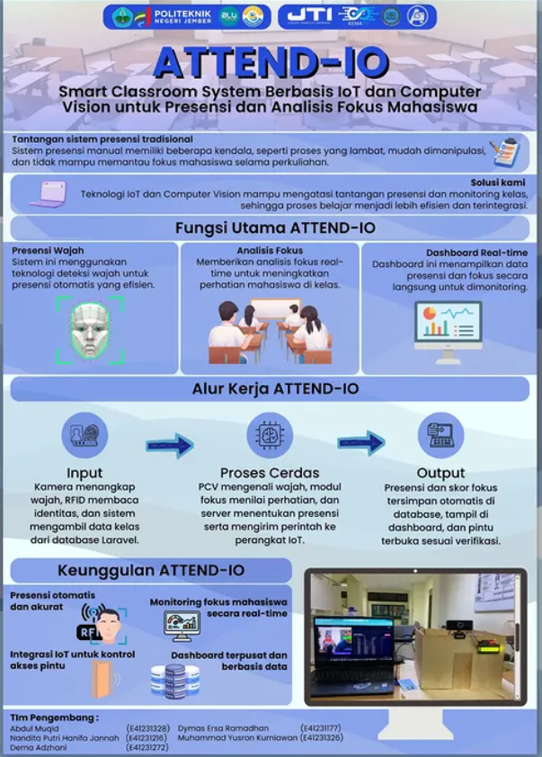

# 🎓 ATTEND-IO: Smart Classroom untuk Presensi dan Monitoring Fokus Mahasiswa

**ATTEND-IO** adalah sistem **Smart Classroom** yang mengintegrasikan teknologi **RFID, Computer Vision, Face Recognition, dan IoT** untuk menghadirkan sistem presensi otomatis sekaligus monitoring fokus mahasiswa secara real-time.

Di era pembelajaran digital, sistem presensi tidak lagi cukup hanya mencatat kehadiran. ATTEND-IO hadir untuk memberikan solusi yang lebih **cerdas, akurat, dan berbasis data** sehingga dosen dapat memahami kondisi kelas secara objektif.

Sistem ini menggabungkan berbagai teknologi modern seperti **Python Computer Vision**, **Face Recognition**, **RFID Scanner**, **ESP32 IoT**, dan **Laravel Backend** dalam satu ekosistem yang terintegrasi.

Dengan ATTEND-IO, presensi tidak hanya menjadi proses administratif, tetapi juga bagian dari **smart classroom ecosystem**.

---

# 🚀 Features

Beberapa fitur utama yang tersedia dalam sistem ATTEND-IO:

### 📡 Smart Attendance (RFID + Face Recognition)

Sistem presensi otomatis menggunakan kombinasi:

- **RFID Card** untuk identifikasi mahasiswa
- **Face Recognition** untuk verifikasi identitas

Metode ini membantu mencegah kecurangan presensi seperti **titip absen**.

---

### 👁 Real-time Focus Monitoring

Menggunakan **Python Computer Vision (PCV)** untuk menganalisis fokus mahasiswa selama pembelajaran.

Sistem akan mendeteksi:

- arah pandangan
- kondisi mata
- tingkat perhatian mahasiswa

Data ini kemudian dikirim ke backend untuk dianalisis.

---

### 🚪 Smart Door Access (IoT)

Menggunakan **ESP32** untuk mengontrol pintu kelas secara otomatis.

Fitur:

- akses pintu hanya untuk mahasiswa yang terdaftar
- terintegrasi dengan sistem presensi
- meningkatkan keamanan ruang kelas

---

### 📊 Lecturer Dashboard

Dashboard berbasis web yang memungkinkan dosen untuk melihat:

- data presensi mahasiswa
- tingkat fokus mahasiswa
- riwayat aktivitas kelas
- statistik kehadiran

Semua data ditampilkan secara **visual dan mudah dipahami**.

---

# 🛠 Tech Stack

Teknologi yang digunakan dalam pengembangan ATTEND-IO:

| Technology | Description |
|-----------|-------------|
| Laravel | Backend API & Dashboard |
| PHP | Server-side programming |
| Python | Computer Vision & Face Recognition |
| OpenCV | Image processing |
| Face Recognition Library | Deteksi wajah mahasiswa |
| MySQL | Database |
| ESP32 | IoT device untuk kontrol pintu |
| RFID Reader | Sistem presensi kartu mahasiswa |
| REST API | Komunikasi antara sistem |

---

# 🏗 System Architecture

ATTEND-IO menggunakan arsitektur sistem terintegrasi sebagai berikut:

```
RFID Reader
     │
     ▼
ESP32 Device ─────► Laravel API
     │                 │
     │                 ▼
     │             MySQL Database
     │
     ▼
Camera System
     │
     ▼
Python Computer Vision
     │
     ▼
Focus Analysis
     │
     ▼
Laravel Backend API
     │
     ▼
Lecturer Dashboard
```


---

# ⚙️ Installation

### 1. Clone repository

```
git clone https://github.com/Dema08/ATTEND-IO-Semester-5.git
```

---

## Backend Laravel Setup

### Install dependency

```
composer install
```

### Setup environment

```
cp .env.example .env
```

### Generate key

```
php artisan key:generate
```

### Run migration

```
php artisan migrate
```

### Run server

```
php artisan serve
```

---

## Python Computer Vision Setup

Install dependency Python:

```
pip install opencv-python
pip install face-recognition
pip install numpy
```

Jalankan modul computer vision:

```
python detect_face.py
```

---

# 📸 System Preview




---

# 🎯 Project Goals

Tujuan utama pengembangan ATTEND-IO:

- Mengotomatisasi sistem presensi mahasiswa
- Mengurangi kecurangan presensi
- Membantu dosen memonitor fokus mahasiswa
- Mengintegrasikan IoT dengan sistem pendidikan
- Mengembangkan konsep **Smart Classroom di Indonesia**

---

# 👥 Our Team

| Name | NIM | Instagram |
|-----|-----|-----------|
| M. Dien Vito Alivio Hidayat | E41231065 | @m.dien_vito |
| Muhammad Yusron Kurniawan | E41231326 | @y.sron_ |
| Dymas Ersa Ramadhan | E41231177 | @dymaser |
| Dema Adzhani | E41231272 | @demadzh |
| Nandita Putri Hanifa Jannah | E41231216 | @na_nditaaph |
| Abdul Muqid | E41231328 | @muqid__ |


